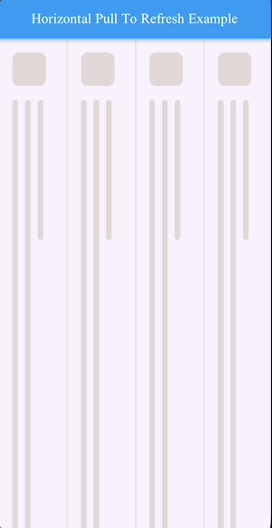

# horizontal-pull-to-refresh

ClojureDart / Flutter horizontal pull-to-refresh: **swipe right from the left edge to refresh**. Indicator colors, copy, text widget, and list content are all customizable. You can also wrap your own horizontal `ListView`.



## Use as a library

Add this repo in the consumer `deps.edn`, and in Flutter `pubspec.yaml`:

```yaml
dependencies:
  custom_refresh_indicator: ^2.2.1
```

If the indicator should use traditional Mongolian (`MongolText`), also add `mongol`.

```clojure
(:require [pull-to-refresh.refresh :as ptr])
```

### Minimal usage (built-in horizontal list)

```clojure
(ptr/horizontal-refresh
 {:on-refresh #(async/Future.delayed (dc/Duration .seconds 2))
  :item-count 20
  :item-builder (fn [ctx idx]
                  (m/Center .child (m/Text (str idx))))})
```

`:on-refresh` must return a `Future`. The indicator retracts automatically when refresh completes.

### Wrap an existing list

```clojure
(ptr/horizontal-refresh
 {:on-refresh on-refresh
  :child
  (m/ListView.builder
   .scrollDirection m/Axis.horizontal
   .physics (m/AlwaysScrollableScrollPhysics
             .parent (m/ClampingScrollPhysics))
   .itemCount n
   .itemBuilder item-builder)})
```

Prefer `ClampingScrollPhysics` on the horizontal list (optionally wrapped with `AlwaysScrollableScrollPhysics`) so edge swipes can be recognized as a refresh gesture.

### Customize the indicator

| Option | Description | Default |
| --- | --- | --- |
| `:direction` | `:right` swipe right (left edge); `:left` swipe left | `:right` |
| `:indicator-width` | Indicator width | `72.0` |
| `:offset-to-armed` | Distance required to trigger refresh | same as width |
| `:not-armed-color` / `:armed-color` / `:loading-color` | Background color per state | blue / teal / teal |
| `:not-armed-text` / `:armed-text` / `:loading-text` | Copy per state; spinner if `:loading-text` is unset | `Swipe to refresh` / `Release to refresh` / spinner |
| `:text-style` | Indicator text style | white, semibold, 16 |
| `:text-builder` | `(fn [text style] widget)`, e.g. `MongolText` | rotated `Text` |
| `:indicator-builder` | `(fn [ctx child controller] widget)` for a fully custom indicator | built-in |
| `:trigger` | Override `IndicatorTrigger` | chosen from `:direction` + `:reverse` |
| `:trigger-mode` | `onEdge` / `anywhere` | `onEdge` |
| `:reverse` | Whether the list is reversed | `false` |
| `:indicator-controller` | External `IndicatorController` | created and disposed internally |

With a reversed list (`:reverse true`), swipe-right still maps to the **visual left edge** (`trailingEdge`).

Vertical Mongolian text example:

```clojure
{:text-builder (fn [text style]
                 (mgl/MongolText text .style style))
 :not-armed-text "Swipe to refresh"
 :armed-text "Release to refresh"
 :loading-text "Refreshing"}
```

For a fully custom indicator, start from `default-indicator-builder` or pass `:indicator-builder`.

## Run the example

The sample app lives in `example/` and depends on this repo as a local library.

```
horizontal-pull-to-refresh/
├── src/pull_to_refresh/refresh.cljd   # library
├── example/                           # Flutter example
│   ├── src/pull_to_refresh_example/main.cljd
│   └── assets/fonts/
├── deps.edn
└── README.md
```

1. Install `clj` and Flutter
2. `cd example`
3. `clj -M:cljd init`
4. `open -a Simulator`
5. `clj -M:cljd flutter`
